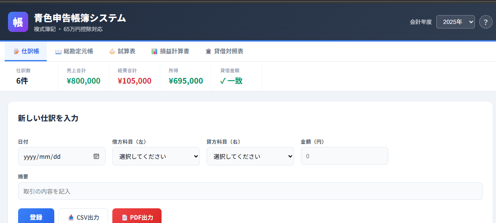

# 📘 青色申告帳簿システム

**個人事業主向け・複式簿記対応の帳簿管理Webアプリ**

仕訳を入力するだけで、青色申告（65万円控除）に必要な帳簿5種類を自動生成します。  
HTMLファイル1つで動作し、インストール不要。ブラウザで開くだけで使えます。



---

## ✨ 特徴

| 特徴 | 説明 |
|------|------|
| 🧾 **複式簿記対応** | すべての仕訳を借方・貸方で記帳。貸借バランスを自動チェック |
| 📑 **帳簿5種自動生成** | 仕訳帳・総勘定元帳・試算表・損益計算書・貸借対照表 |
| 📄 **PDF出力** | 各帳票をA4サイズでPDF保存可能（ブラウザ印刷機能を利用） |
| 📥 **CSV出力** | 仕訳データをCSVでエクスポート（Excel等で利用可能） |
| 💾 **自動保存** | ブラウザのlocalStorageにデータを自動保存。次回も継続利用可能 |
| 📱 **レスポンシブ対応** | PC・タブレット・スマートフォンで利用可能 |
| 🔒 **オフライン動作** | インターネット接続不要。ローカルで完結 |
| 📦 **依存ゼロ** | 外部ライブラリ不使用。HTML/CSS/JavaScript のみで構築 |

---

## 🖥️ デモ

**GitHub Pages**: [https://bondia202510.github.io/aoiro-bookkeeping/index.html](https://bondia202510.github.io/aoiro-bookkeeping/index.html)

> ※ 上記URLはGitHub Pagesを有効にした後に利用可能になります。

---

## 📸 スクリーンショット

### 仕訳帳
仕訳の入力・編集・削除が可能。日付順に自動ソートされます。

### 総勘定元帳
勘定科目ごとの取引明細と残高推移を表示。科目をワンクリックで切替。

### 試算表
借方・貸方の合計と残高を一覧表示。貸借一致を自動検証。

### 損益計算書（P/L）
売上高 → 売上原価 → 経費 → 営業外損益を段階的に表示。  
青色申告特別控除前の所得金額を自動算出。

### 貸借対照表（B/S）
資産の部と負債・資本の部を左右に並べて表示。  
当期所得を反映し、貸借一致を自動検証。

---

## 🚀 使い方

### 方法1: ファイルを直接開く

1. `index.html` をダウンロード
2. ダブルクリックでブラウザが起動
3. すぐに使い始められます

### 方法2: GitHub Pages で公開

1. このリポジトリをフォーク
2. Settings → Pages → Source を `main` ブランチに設定
3. 公開URLにアクセス

### 基本操作

1. **仕訳入力**: 日付・借方科目・貸方科目・金額・摘要を入力して「登録」
2. **帳簿閲覧**: 上部タブで5種の帳簿を切替
3. **PDF出力**: 各タブの「📄 PDF出力」ボタン → 印刷画面で「PDFに保存」を選択
4. **CSV出力**: 仕訳帳タブの「📥 CSV出力」ボタン

---

## 🏗️ 技術構成

```
青色申告帳簿システム
│
├── フロントエンド
│   ├── HTML5        … 構造・セマンティクス
│   ├── CSS3         … レスポンシブデザイン・CSS変数
│   └── JavaScript   … ビジネスロジック・DOM操作
│
├── データ管理
│   └── localStorage … クライアントサイド永続化
│
├── 出力機能
│   ├── PDF出力      … window.print() ベース
│   └── CSV出力      … Blob API
│
└── 会計ロジック
    ├── 複式簿記エンジン
    ├── 勘定科目マスタ（約45科目）
    ├── 試算表自動生成
    ├── 損益計算書自動生成
    └── 貸借対照表自動生成
```

### 設計方針

- **Single File Architecture**: HTML/CSS/JS を1ファイルに統合し、配布・共有の容易さを最優先
- **Zero Dependencies**: 外部ライブラリに依存せず、ブラウザ標準APIのみで実装
- **Data-Driven Rendering**: 仕訳データから全帳簿を都度計算・描画するリアクティブ設計
- **Separation of Concerns**: データ層（計算ロジック）・UI層（描画）・アクション層（イベント処理）を関数単位で分離

---

## 📊 対応勘定科目（約45科目）

### 資産（Assets）
現金 / 普通預金 / 売掛金 / 商品 / 前払費用 / 貯蔵品 / 建物 / 車両運搬具 / 工具器具備品 / 土地 / 減価償却累計額

### 負債（Liabilities）
買掛金 / 未払金 / 未払費用 / 預り金 / 前受金 / 借入金

### 資本（Equity）
元入金 / 事業主借 / 事業主貸

### 収益（Revenue）
売上高 / 雑収入 / 受取利息

### 費用（Expenses）
仕入高 / 給料賃金 / 外注工賃 / 減価償却費 / 地代家賃 / 水道光熱費 / 旅費交通費 / 通信費 / 広告宣伝費 / 接待交際費 / 損害保険料 / 修繕費 / 消耗品費 / 福利厚生費 / 荷造運賃 / 支払手数料 / 租税公課 / 新聞図書費 / 諸会費 / 支払利息 / 雑費

---

## 🔧 カスタマイズ

### 勘定科目の追加・変更

`AC` 配列にオブジェクトを追加するだけで勘定科目を増やせます:

```javascript
// 例: 「リース料」を経費に追加
{c:"895", n:"リース料", cat:"expense", g:"経費"}
```

### 会計年度の追加

HTMLの `<select>` タグに `<option>` を追加:

```html
<option value="2027">2027年</option>
```

---

## 📁 ファイル構成

```
aoiro-bookkeeping/
├── index.html      … アプリ本体（これ1つで動作）
├── README.md       … このファイル
├── LICENSE         … ライセンス
└── screenshot.png  … スクリーンショット（任意）
```

---

## ⚠️ 注意事項

- 本システムは学習・ポートフォリオ目的で作成されたものです
- 実際の確定申告にご利用の際は、税理士等の専門家にご確認ください
- データはブラウザのlocalStorageに保存されます。ブラウザのデータを消去すると仕訳データも消えます
- 重要なデータはCSV出力機能でバックアップを取ることをおすすめします

---

## 📝 今後の拡張アイデア

- [ ] 仕訳データのJSON インポート/エクスポート
- [ ] 複合仕訳（1つの取引で複数の借方・貸方）対応
- [ ] 月次推移表の追加
- [ ] 消費税区分の追加（課税・非課税・免税）
- [ ] 勘定科目のカスタマイズUI
- [ ] ダークモード対応

---

## 📄 ライセンス

MIT License

---

## 👤 作者

**あなたの名前**

- GitHub: [bondia202510](https://github.com/bondia202510)
- Portfolio: [(https://bondia202510.github.io/)](https://bondia202510.github.io/aoiro-bookkeeping/)

---

<p align="center">
  ⭐ このプロジェクトが参考になったらStarをお願いします！
</p>
